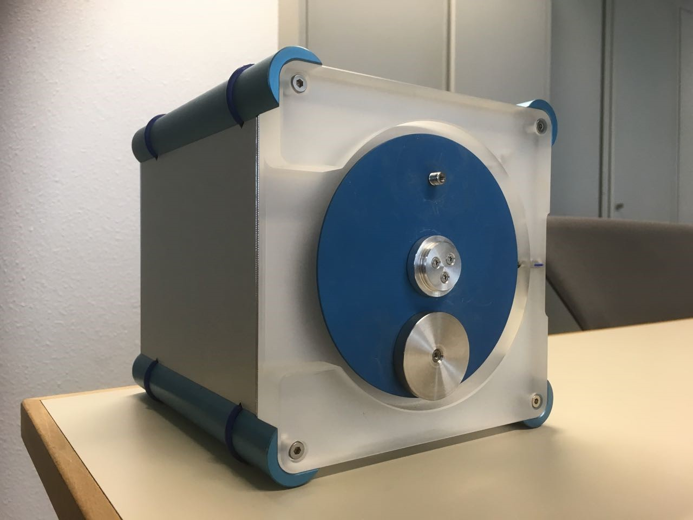

# Machine Learning for System and Control
A final project of 5SC28-Machine Learning for System and Control 2021/2022 course at TU Eindhoven. The project is all about the unbalanced disk modelling and controlling it so that it can swing up and also having a $\pm10^{\circ}$ after reaching the $180^{\circ}$ swing-up for the multi-target policy.

## Data-driven modelling (System Identification) 

The modelling here are using the NARX model structure, where it is implemented in both the [Gaussian Process and Artificial Neural Network](./ANN&GP.ipynb) using `scikit-learn` and `PyTorch` respectively. For the Gaussian Process, we managed to use the exact method of inference, thus it may take several hours to train the Gaussian Process. For the [grid search Gaussian Process](./Final_GP.ipynb) implementation, it provides a good approximations as well.

## Data-driven control (Reinforcement Learning)
The overall objective is to control an unbalanced disk to swing-up or making a swing-up policy (see [Gym Unbalacned Disk](https://github.com/GerbenBeintema/gym-unbalanced-disk) library by Gerben Beintema). There are several methods that we have done, which are:
1. [DQN](./DQN.ipynb) (Deep Q-Network) with `stable-baselines3`
2. [SAC](./SAC.ipynb) (Soft Actor-Critic) with `stable-baselines3`
3. [Classical Q-Learning](./clas-Q-learning.ipynb) (Tabular Q-learning)
4. [Multi_SAC](./Multi_SAC.ipynb) for multi-target policy $\pm10^{\circ}$ using the SAC method with `stable-baselines3`
